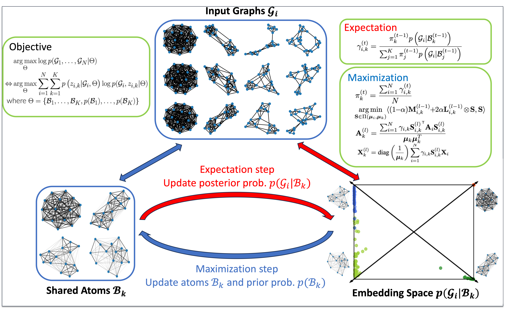

# Generative Graph Dictionary Learning

## Overview
Implementation of "Generative Graph Dictionary Learning" in ICML23

  

**prerequisites**
- pot>=0.9.0
- numpy>=1.22.4
- scikit-learn>=1.1.2

**code**
- config: parameter configurations for different tasks
- frame: basic modules for FraMe
    - bregman.py: sinkhorn iterations
    - fgw_utils.py: module for FGW calculation
    - fgwb.py: FGW barycenter computation module
    - frame.py: implementation of FraMe
    - optim.py: optimization module
- graph_classification.py: run this file for graph classification by FraMe
- graph_clustering.py: run this file for graph clustering by FraMe
- node_clustering.py: run this file for node classification by FraMe

**datasets**

all datasets used in the paper are downloaded from the [Benchmark Data Sets for Graph Kernels](https://ls11-www.cs.tu-dortmund.de/staff/morris/graphkerneldatasets) and benchmarked in the *dataset* folder.

|dataset   |#graphs   |#features   |#graph class |#node class
|---|---|---|---|---|
|AIDS|2000|4|2|38|
|DBLP|19,456|None|2|None|
|ENZYMES|600|18|6|3|
|IMDB-M|1,500|None|3|None|
|PROTEINS|1,113|1|2|3|
|PTC-MR|344|None|2|19|

## Reference
Zhichen Zeng, Ruike Zhu, Yinglong Xia, Hanqing Zeng, and Hanghang Tong. Generative Graph Dictionary Learning. In *International Conference on Machine Learning*. 2023

## Acknowledgement
This work is built upon the wonderful [Python Optimal Transport toolbox](https://pythonot.github.io/) and the [Fused Gromov-Wasserstein repository](https://github.com/tvayer/FGW).

